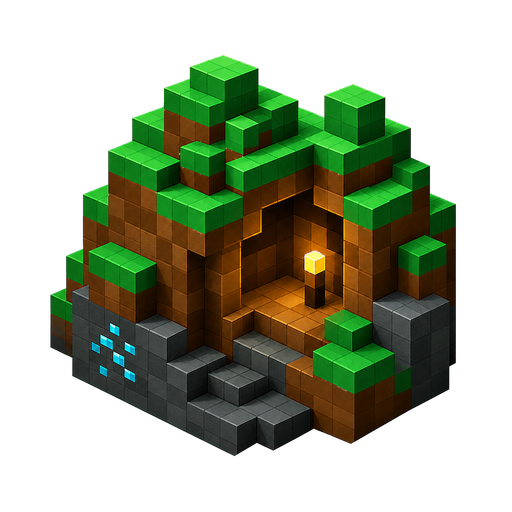
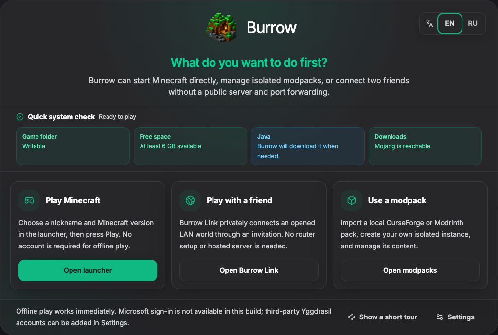

# Burrow

[English](README.md) · [Русский](README.ru.md) · [Download](https://github.com/malyarq/burrow/releases/latest) · [Documentation](docs/README.md)

[](https://github.com/malyarq/burrow/actions/workflows/ci.yml) [](https://github.com/malyarq/burrow/releases/latest) [](LICENSE)



**Play local. Bring a friend.**

Burrow is a privacy-first desktop Minecraft launcher for vanilla play, isolated modpacks, local content management, and direct play with a friend. It runs on Windows, macOS, and Linux.



## Why Burrow

- **Play together without renting a server.** Burrow Link connects a world opened to LAN through a copyable invitation. The joining player uses the local address shown by Burrow.
- **Keep control of your data.** Game data, settings, accounts, and instances stay local. Anonymous product analytics is off by default and has a documented event allowlist.
- **Use vanilla or modded Minecraft.** Burrow supports Forge, Fabric, NeoForge, OptiFine, isolated instances, and Modrinth content.
- **Move safely between computers.** Export launcher settings without account tokens or analytics identifiers, and export important modpacks separately.
- **Understand what the launcher is doing.** Long installs and updates expose progress, cancellation, recovery, and actionable failure states.

## Current capabilities

| Area | Available now |
| --- | --- |
| Minecraft | Vanilla launch, automatic Java 8/17/21 selection, Forge, Fabric, NeoForge, OptiFine |
| Modpacks | Create, import, export, duplicate, rename, update, delete, browse Modrinth |
| Content | Mods, resource packs, shaders, worlds, datapacks, screenshots |
| Accounts | Offline profiles and supported third-party Yggdrasil/authlib-injector providers |
| Multiplayer | Burrow Link, optional LAN discovery, optional UPnP diagnostics |
| Safety | Atomic writes, operation recovery, archive/path validation, checksummed release artifacts |
| Languages | English and Russian |

Microsoft sign-in is not available yet. CurseForge archive import/export works, but official builds do not browse CurseForge until its API and distribution contract are configured end to end.

## Install

Download the latest package and `SHA256SUMS.txt` from [GitHub Releases](https://github.com/malyarq/burrow/releases/latest).

| Platform | Artifact |
| --- | --- |
| Windows | `Burrow-Windows-<version>-Setup.exe` |
| macOS | `Burrow-Mac-<version>-Installer.dmg` |
| Linux | `Burrow-Linux-<version>.AppImage` |

> [!WARNING]
> Windows packages and macOS DMGs are not publisher-signed. Local macOS builds use an ad-hoc signature only so the app can run after Electron fuses are applied; it does not authenticate the publisher. Download only from this repository and verify the matching SHA-256 checksum. Your operating system may show an unknown-developer warning.

The [user guide](docs/en/user-guide.md) explains checksum verification, first launch, Burrow Link, updates, and backups.

## Development

Requirements: Node.js 24.x, npm 11.x, and Git.

```bash
nvm use
npm ci
npm run verify
npm run dev
```

Build production packages locally without publishing:

```bash
npm run build -- --publish never
```

`npm run verify` runs unit tests, ESLint, TypeScript, documentation and IPC contract checks, and the production dependency audit. Packaging and real Minecraft installation are separate checks; see [Testing](docs/en/testing.md).

## Documentation

- [User guide](docs/en/user-guide.md)
- [Troubleshooting](docs/en/troubleshooting.md)
- [Privacy](docs/en/privacy.md)
- [Security](docs/en/security.md)
- [Development](docs/en/development.md)
- [Architecture](docs/en/architecture.md)
- [Testing](docs/en/testing.md)
- [Release process](docs/en/releasing.md)
- [Known issues](docs/en/known-issues.md)
- [Contributing](CONTRIBUTING.md)
- [Changelog](CHANGELOG.md)

## Project status

The launcher is engineering-complete for its current feature set, but public alpha confidence still depends on fresh-install smoke tests on each target OS. Code signing, Microsoft authentication, and external-user product proof remain separate gates. Product direction is summarized in the short [product gate](docs/en/roadmap.md).

Burrow is not affiliated with Mojang or Microsoft and does not grant ownership of Minecraft. The project is available under the [MIT License](LICENSE).
