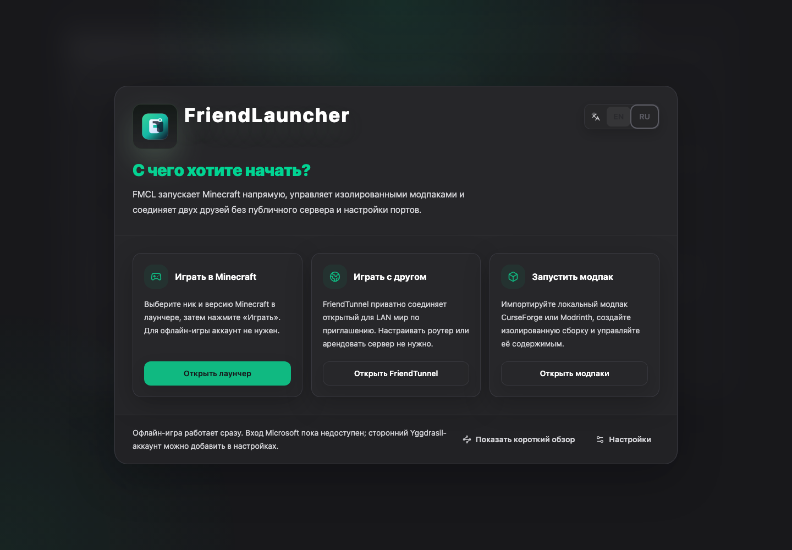

# FriendLauncher

[English](README.md) · [Русский](README.ru.md) · [Скачать](https://github.com/malyarq/fmcl/releases/latest) · [Документация](docs/README.md)

FriendLauncher (FMCL) — приватный настольный лаунчер Minecraft для обычной игры, изолированных модпаков, управления локальным контентом и прямой игры с другом. Работает на Windows, macOS и Linux.



## Зачем FriendLauncher

- **Играть вдвоём без аренды сервера.** FriendTunnel соединяет открытый для LAN мир по копируемому приглашению. Второй игрок использует локальный адрес, который покажет FMCL.
- **Сохранять контроль над данными.** Игровые данные, настройки, аккаунты и сборки остаются на компьютере. Анонимная продуктовая аналитика по умолчанию выключена, а список событий зафиксирован в документации.
- **Запускать обычный и модифицированный Minecraft.** FMCL поддерживает Forge, Fabric, NeoForge, OptiFine, изолированные сборки и контент из Modrinth.
- **Безопасно переносить настройки.** Настройки можно экспортировать без токенов аккаунтов и идентификатора аналитики, а важные модпаки — сохранить отдельными архивами.
- **Понимать состояние операции.** Долгие установки и обновления показывают прогресс, отмену, восстановление и понятную причину ошибки.

## Что уже работает

| Область | Возможности |
| --- | --- |
| Minecraft | Обычный запуск, автоматический выбор Java 8/17/21, Forge, Fabric, NeoForge, OptiFine |
| Модпаки | Создание, импорт, экспорт, копирование, переименование, обновление, удаление, каталог Modrinth |
| Контент | Моды, ресурспаки, шейдеры, миры, датапаки, скриншоты |
| Аккаунты | Офлайн-профили и поддерживаемые сторонние Yggdrasil/authlib-injector провайдеры |
| Совместная игра | FriendTunnel, дополнительный поиск в LAN и диагностика UPnP |
| Надёжность | Атомарная запись, восстановление операций, проверка архивов и путей, контрольные суммы релизов |
| Языки | Русский и английский |

Вход через Microsoft пока недоступен. Импорт и экспорт архивов CurseForge работает, но каталог CurseForge в официальных сборках выключен до полного решения вопросов API и правил распространения.

## Установка

Скачайте последний пакет и `SHA256SUMS.txt` со страницы [GitHub Releases](https://github.com/malyarq/fmcl/releases/latest).

| Платформа | Файл |
| --- | --- |
| Windows | `FriendLauncher-Windows-<version>-Setup.exe` |
| macOS | `FriendLauncher-Mac-<version>-Installer.dmg` |
| Linux | `FriendLauncher-Linux-<version>.AppImage` |

> [!WARNING]
> Windows-пакеты и macOS DMG пока не подписаны издателем. Локальная macOS-сборка получает только ad-hoc подпись, чтобы приложение запускалось после настройки Electron fuses; личность издателя она не подтверждает. Скачивайте файлы только из этого репозитория и до запуска сверяйте SHA-256. Операционная система может показать предупреждение о неизвестном разработчике.

Проверка контрольной суммы, первый запуск, FriendTunnel, обновления и резервные копии описаны в [руководстве пользователя](docs/ru/user-guide.md).

## Разработка

Нужны Node.js 24.x, npm 11.x и Git.

```bash
nvm use
npm ci
npm run verify
npm run dev
```

Локальная сборка пакетов без публикации:

```bash
npm run build -- --publish never
```

`npm run verify` запускает модульные тесты, ESLint, TypeScript, проверки документации и IPC-контрактов и аудит production-зависимостей. Упаковка и реальная установка Minecraft проверяются отдельно; подробности — в документе [Тестирование](docs/ru/testing.md).

## Документация

- [Руководство пользователя](docs/ru/user-guide.md)
- [Решение проблем](docs/ru/troubleshooting.md)
- [Приватность](docs/ru/privacy.md)
- [Безопасность](docs/ru/security.md)
- [Разработка](docs/ru/development.md)
- [Архитектура](docs/ru/architecture.md)
- [Тестирование](docs/ru/testing.md)
- [Выпуск релиза](docs/ru/releasing.md)
- [Известные проблемы](docs/ru/known-issues.md)
- [Участие в разработке](CONTRIBUTING.md)
- [История изменений](CHANGELOG.md)

## Состояние проекта

Текущий набор функций доведён до инженерной готовности. Для уверенной публичной альфы ещё нужны проверки чистой установки на каждой целевой ОС. Подпись пакетов, вход Microsoft и проверка продукта внешними пользователями — отдельные условия. Краткое направление описано в [продуктовом ограничителе](docs/ru/roadmap.md).

FriendLauncher не связан с Mojang или Microsoft и не предоставляет право владения Minecraft. Проект распространяется по [лицензии MIT](LICENSE).
