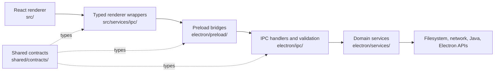

# Architecture

FriendLauncher is an Electron desktop application with a React renderer built by Vite. The architecture keeps web content away from Node.js and operating-system capabilities.



## Process boundaries

### Renderer (`src/`)

The renderer owns UI, local presentation state, translations, and feature orchestration. It runs with `nodeIntegration: false`, `contextIsolation: true`, and Electron sandboxing enabled.

Rules:

- Do not import Node.js or Electron modules.
- Do not access the filesystem or network through ad-hoc browser globals.
- Prefer a wrapper from `src/services/ipc/*`; UI components should not spread `window.api.*` calls across the tree.
- Keep user-facing strings in both `src/locales/en.json` and `src/locales/ru.json`.

### Preload (`electron/preload.ts`, `electron/preload/bridges/`)

Preload is the capability boundary between renderer and main. It exposes exactly one global, `window.api`, described by `shared/contracts/windowApi.ts`. Every capability is a narrow domain contract; raw `invoke`, `send`, `on`, and `off` are not exposed to renderer code.

### Main process (`electron/`)

The main process owns windows, lifecycle, native dialogs, Java processes, downloads, archives, account storage, game files, updater behavior, and multiplayer networking.

- `electron/app/` — bootstrap, lifecycle, service composition, full-install harness
- `electron/window/` — hardened BrowserWindow creation and navigation guards
- `electron/ipc/` — handler registration and validation at the process boundary
- `electron/security/` — path, URL, archive, permission, and save-path policies
- `electron/services/` — domain behavior
- `electron/preload/` — typed capabilities exposed to the renderer

IPC handlers should validate unknown input and delegate to services. Services must not import handler registration or preload code.

### Shared contracts (`shared/`)

- `shared/contracts/*` defines preload interfaces and IPC-facing DTOs.
- `shared/contracts/ipcChannels.ts` is the channel allowlist.
- `shared/contracts/windowApi.ts` defines the supported `window.api` surface.
- `shared/types/*` contains cross-process domain data.

Do not create a second copy of a cross-process payload type in the renderer or main process.

## Main domains

| Domain | Main-process owner | Renderer owner |
| --- | --- | --- |
| Launch and Java | `electron/services/launcher/`, `electron/services/java/` | `src/features/launcher/`, `src/components/SimplePlayDashboard.tsx` |
| Modpack instances | base filesystem/index service in `electron/services/instances/`; extended import, metadata, content, and export facade in `electron/services/modpacks/` | `src/components/modpacks/`, `src/features/modpacks/`, `src/contexts/ModpackContext.tsx` |
| Mods and providers | `electron/services/mods/` | modpack content screens and `src/services/ipc/modsIPC.ts` |
| Accounts | `electron/services/account/` | `src/features/accounts/` |
| Multiplayer | `electron/services/network/` | `src/features/multiplayer/` |
| Updates | `electron/services/updater/` | `src/features/updater/` |
| Content | `electron/services/{resourcePacks,shaders,worlds,screenshots,content}/` | modpack detail/content features |

The extended `electron/services/modpacks/modpackService.ts` currently subclasses the lower-level instance service. This is an intentional compatibility seam, not a recommendation to keep adding responsibilities to the facade.

## Durable local state

Maintained JSON control files use the versioned `AtomicJsonStore` in `electron/services/storage/`. Writes are staged beside the destination, flushed, and atomically renamed; the previous valid document is retained as `.bak`. A malformed or unsupported document fails closed and is preserved for recovery instead of being replaced by an empty default. Rebuildable caches and third-party Minecraft formats are deliberately outside this contract.

Multi-file installs, imports, updates, and destructive operations are staged, journaled, and recovered by the operation engine. Atomic control files prevent torn individual documents; they complement rather than replace the journaled directory-wide workflow. Archive export is the deliberate external-path exception: after restart it becomes `recovery-required` and preserves every artifact because an untrusted journal cannot recreate the expired native-dialog write authority.

### Root mutation lock protocol

Destructive root-wide operations use protocol v3 in `.fmcl-operations/locks`. Immutable Lamport choosing and ticket records select one writer; each record carries a random token and the owning process's unique local Node socket path. A contender removes a record only after the socket definitively refuses or rejects that token. Timeouts and other ambiguous local-network failures remain live and block the operation. Token death never authorizes deletion of the shared process endpoint. A process killed with `SIGKILL` may therefore leave an inert, randomly named socket entry in the system temporary directory; it is never reused. This avoids PID-reuse and elapsed-time liveness decisions, including while a process is suspended.

After winning the bakery turn, the writer holds the atomically published canonical `mutation.lock` bridge for its whole callback. This prevents an ordinary live old O_EXCL owner from running beside a v3 callback. The `mutation.lock.v3` marker is an offline upgrade boundary: stop every FMCL process that shares a custom launcher root before upgrading to v3, downgrading, or mixing builds. A pre-v3 canonical marker is not reclaimed by v3; the operation fails closed with `ROOT_LOCK_OFFLINE_UPGRADE_REQUIRED`. Pre-v3 stale-reclaimer races are explicitly unsupported.

## Dependency direction

Allowed default direction:

```text
renderer component/context
  -> renderer IPC wrapper
  -> preload contract/bridge
  -> validated IPC handler
  -> domain service
  -> operating system or external provider
```

Reverse imports are not allowed. In particular, domain services must not import renderer, preload, or IPC registration modules.

## Security invariants

- Renderer input is untrusted at the main-process boundary.
- File paths must be resolved through the central path guards and stay within an approved root.
- Remote URLs must use the approved URL policy; archives must use the shared archive policy.
- Account secrets stay in the main process and are encrypted with Electron `safeStorage` when available.
- External navigation is denied in-app and routed through validated external-link handling.
- Application updates require user consent before download.

See [Security model](security.md) and [Known issues](known-issues.md) for the complete current posture.

## Multi-instance development

Development can start a second local instance with a suffixed Electron `userData` directory. Local helper ports derive from that instance slot; do not add a new fixed port without using the same allocation model.

## Changing a cross-process feature

Trace and update the full path:

1. shared type or contract;
2. preload bridge and `window.api` type;
3. main-process validation and handler;
4. domain service;
5. renderer wrapper;
6. UI consumer and tests;
7. contract map and both language variants when a channel changes.

Run `npm run contracts:check`, `npm run ipc:check`, `npm run architecture:check`, and the relevant tests before review.
