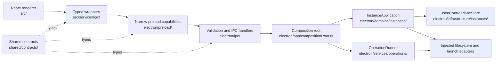
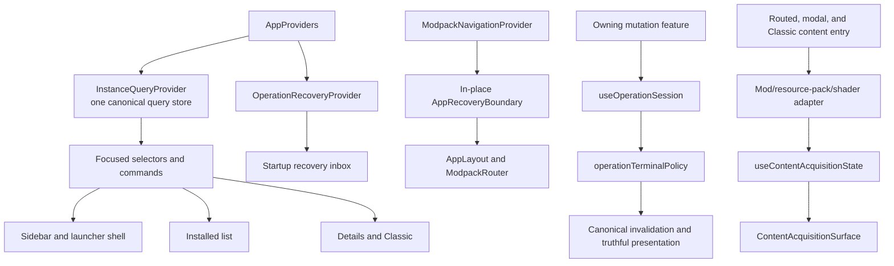
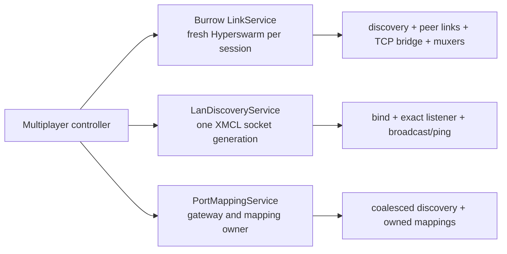

# Architecture

Burrow is an Electron desktop application with a React renderer built by Vite. The main process owns every native capability and composes one canonical instance domain; the renderer receives typed, path-free operations rather than filesystem access.



## Process boundaries

### Renderer (`src/`)

The renderer owns UI, translations, presentation state, and feature orchestration. It runs with `nodeIntegration: false`, `contextIsolation: true`, and Electron sandboxing enabled.

Rules:

- Do not import Node.js or Electron modules.
- Do not accept or reconstruct launcher roots, instance paths, archive paths, or Java executable paths.
- Use wrappers from `src/services/ipc/*`; components should not spread `window.api.*` calls through the tree.
- Keep user-facing strings in both `src/locales/en.json` and `src/locales/ru.json`.
- Launch UI lives in one tree, `src/features/launcher/`; do not create a parallel launcher implementation.

### Preload (`electron/preload.ts`, `electron/preload/bridges/`)

Preload is the capability boundary between renderer and main. It exposes exactly one global, `window.api`, described by `shared/contracts/windowApi.ts`. Each member is a narrow semantic contract. Raw `invoke`, `send`, `on`, and `off` are not available to renderer code.

An opaque ID is not a path alias. Archive references are sender-bound, expiring, and single-use. Java installation IDs are short-lived and bound to the launcher root used for the scan.

### Main process (`electron/`)

The main process owns lifecycle, windows, native dialogs, Java processes, downloads, archives, accounts, game files, updater behavior, and multiplayer networking.

- `electron/app/` — bootstrap and the only production composition root
- `electron/domains/instances/` — canonical instance commands, state, ports, and application service
- `electron/infrastructure/instances/` — control-plane and filesystem adapters
- `electron/services/operations/` — staged operations, journal, root lock, and recovery
- `electron/services/*` — narrow content, provider, launcher, account, network, and updater services
- `electron/ipc/` — input validation and handler registration
- `electron/security/` — path, URL, archive, authorization, and save-path policies
- `electron/preload/` — typed capabilities exposed to the renderer

`electron/app/bootstrap.ts` constructs the graph once, recovers registered operations before handlers become available, and passes injected dependencies to `IPCManager`. Production handlers and services must not construct their own instance store, application, or operation runner.

### Shared contracts (`shared/`)

- `shared/contracts/*` defines preload interfaces and serializable IPC DTOs.
- `shared/contracts/ipcChannels.ts` is the channel allowlist.
- `shared/contracts/windowApi.ts` defines the complete supported `window.api` surface.
- `shared/types/*` contains data shared across processes.

Do not create a second copy of a cross-process payload type in renderer or main code. Public operation requests cannot contain `rootPath` or `filePath`.

## Ownership graph

| Domain | Canonical main-process owner | Renderer owner |
| --- | --- | --- |
| Instance lifecycle and selected state | `electron/domains/instances/instanceApplication.ts`, backed by `electron/infrastructure/instances/jsonControlPlaneStore.ts` | `src/features/instances/InstanceQueryProvider.tsx` plus focused selector, invalidation, and command hooks |
| Transactional import, export, install, update, duplicate, delete | `electron/services/operations/operationRunner.ts` and operation adapters | `src/features/operations/`, `operationsIPC.ts`, and the feature that starts the operation |
| Instance mod files and manifest registration | `electron/services/mods/instanceModContentService.ts`, `manifestContentInstaller.ts` | typed content adapters under `src/features/content/` and instance-scoped detail surfaces |
| Launch and Java | `electron/services/launcher/`, `electron/services/java/`, injected instance/launch ports | `src/features/launcher/`, `src/components/SimplePlayDashboard.tsx` |
| Provider catalog and installs | `electron/services/mods/platform/` and provider operation adapters | `useModpackBrowserCatalog`, typed content adapters, and semantic IPC wrappers |
| Accounts | `electron/services/account/` | `src/features/accounts/` |
| Multiplayer | `Burrow LinkService`, `LanDiscoveryService`, and `PortMappingService` under `electron/services/network/` | one live capability controller under `src/features/multiplayer/` |
| Updates | `electron/services/updater/` | `src/features/updater/` |
| Resource packs, shaders, worlds, datapacks, screenshots | narrow services and validated handlers under `electron/services/` and `electron/ipc/handlers/` | modpack detail/content features |

There is no base instance store plus inherited modpack facade. `InstanceApplication` is the single public owner of instance control-plane reads and commands. Semantic services depend on its ports and add only their own content behavior.

## Renderer workflow ownership



### Canonical instance state

`AppProviders` mounts exactly one `InstanceQueryProvider`. Its store makes one catalog request and publishes the instance list and selected ID from the same response. ID-keyed snapshots are retained only while consumed; concurrent reads and invalidations are coalesced, stale generations are ignored, and configuration writes are serialized per instance before canonical invalidation.

Shell, installed list, Details, Classic, Settings, and launch code read focused selectors from `src/features/instances/hooks/`. Commands cross semantic services in `src/contexts/instances/services/` and return to the same provider through explicit invalidation. There is no `ModpackContext`, aggregate compatibility hook, local selected-instance store, or fallback list cache.

### Operations and recovery

Each mutation feature owns its call to `useOperationSession`; the hook owns subscription release, cancellation, terminal callback ordering, reset, and explicit retry. `operationTerminalPolicy.ts` is the single classifier for durable commit, canonical invalidation, and presentation success. A degraded committed result may invalidate state, but it cannot select an instance, close the surface, or claim success.

`OperationRecoveryProvider` mounts once inside the query provider. It accepts only internally consistent sanitized recovered records, invalidates a committed operation at most once, and exposes inspection, durable bounded dismissal, and safe navigation. The inbox is not mounted in the dedicated debug-console renderer. It never reconstructs hidden input or generically replays an operation. Consumed archive references and expired native save authorization require a new user action.

`ModpackNavigationProvider` is mounted above `AppRecoveryBoundary`, so route and back history survive in-place recovery. The feature boundary refreshes canonical instances and the recovery inbox without reloading the renderer. Only the provider-free bootstrap boundary may request a full renderer reload after an unrecoverable bootstrap failure.

### Content and surface boundaries

Mods, resource packs, and shaders share `useContentAcquisitionState` and `ContentAcquisitionSurface`, but each keeps a typed adapter for its real provider, runtime, local-file, manifest, and retry semantics. Partial commits retain only failed logical selections. A committed file is never downloaded again merely because follow-up invalidation or manifest registration failed.

Installed list, browser, creation, Classic, Appearance, and Details are split into controller/state and render-focused modules. Persistent navigation and settings owners stay outside `Suspense`. List, Details, Appearance, and Storage remain eager; optional modpack routes and the heavy Downloads, Launcher, Accounts, and Statistics settings tabs are lazy only where production bundle measurements justified the boundary. Every fallback is a labelled polite status and does not replace route state.

## Networking and application lifecycle

Networking has no global mutable mode and no mixed god service. The selected instance's `networkMode` chooses a renderer surface only; each main-process capability owns its own resources and typed lifecycle snapshot:



Burrow Link validates fixed-size room codes, attaches connection handling before discovery flush, aborts pending peer waits, and awaits discovery, local TCP server, sockets, and swarm destruction. Its mux parser bounds frames and buffered bytes, rejects invalid command/session transitions, allocates collision-free session IDs, and contains protocol faults to the peer connection. Remote close never echoes another close.

LAN start/stop is serialized and listener cleanup captures the exact XMCL generation. Ping responses are copied into bounded serializable DTOs. UPnP coalesces gateway discovery, removes mapping state only after successful unmap, and uses `gateway.stop()` for complete cleanup. A failed cleanup remains a typed failed state instead of falsely reporting idle. One capability failure never stops the other two.

Session truth comes from main snapshots and subscriptions. Local storage retains only tab, port, and room-code input convenience; old persisted room/mapped-port values are deleted and can never resurrect a phantom active session.

### Startup and shutdown order

Normal startup is ordered as follows:

```text
Electron ready
  -> start or verify local AuthServer
  -> construct one composition root
  -> recover operation journals
  -> create window and tray
  -> install application lifecycle owner
  -> register IPC handlers
```

The first `before-quit` event is prevented while one shared shutdown promise runs:

```text
unregister IPC admission
  -> stop OperationRunner admission and drain durable terminal records
  -> stop InstanceApplication admission and drain admitted config writes
  -> stop Burrow Link, LAN, and UPnP independently
  -> stop the owned AuthServer
  -> destroy the tray
  -> reissue app.quit under a completion guard
```

Repeated quit requests share the same promise. Cleanup failures are collected without skipping unrelated owners. A running Minecraft process is intentionally independent and is not killed when the launcher closes. `app.exit()` is reserved for an already-cleaned startup failure or the isolated full-install test because Electron skips normal quit events for that API.

## Canonical durable state

The sole maintained instance control-plane document is `<launcher-root>/instance-control-plane.json`. `JsonControlPlaneStore` reads and writes it through the versioned `AtomicJsonStore`: a write is staged beside the destination, flushed, and atomically renamed, while the previous valid document is retained as `.bak`. Malformed or unsupported documents fail closed and are preserved for recovery.

Ordinary reads never inspect or rewrite legacy state. Only the explicit preparation path may read `modpacks.json`, `modpacks-metadata.json`, and per-instance `modpack.json`. It validates the complete legacy graph, publishes one canonical snapshot with migration provenance, and then treats the canonical primary or backup as authoritative on every retry. Rebuildable caches and third-party Minecraft formats are deliberately outside this control-plane contract.

## Transaction lifecycle and recovery

Multi-file mutations use this lifecycle:

```text
validate public command
  -> resolve launcher root and native references in main
  -> acquire root mutation lock
  -> stage private artifacts
  -> validate staged result
  -> preserve backup when required
  -> publish filesystem changes
  -> commit the canonical InstanceApplication command
  -> publish a sanitized operation snapshot
```

`OperationRunner` owns queueing, cancellation, journal persistence, the root lock, and registered recovery commands. The journal may contain internal main-process paths needed for recovery; public operation contracts and renderer wrappers may not. Active operations are scoped to their originating renderer. Recovered snapshots are sanitized, terminal, read-only records.

Archive import consumes an opaque `archiveRef`; the renderer never receives the selected path. Archive export is the one deliberate public native-save exception: `outputPath` is created by a main-process save dialog, authorized for that sender, consumed once by the operation handler, and then retained only inside main recovery data. After restart an unfinished export becomes `recovery-required`, because an untrusted journal cannot recreate expired native write authority.

### Root mutation lock protocol

Destructive root-wide operations use protocol v3 in `.fmcl-operations/locks`. Immutable Lamport choosing and ticket records select one writer; each record carries a random token and the owning process's unique local Node socket path. A contender removes a record only after the socket definitively refuses or rejects that token. Timeouts and ambiguous local-network failures remain live and block the operation. This avoids PID-reuse and elapsed-time liveness decisions, including while a process is suspended.

After winning the bakery turn, the writer holds the atomically published canonical `mutation.lock` bridge for the whole callback. The `mutation.lock.v3` marker is an offline upgrade boundary: stop every Burrow process sharing a custom launcher root before upgrading to v3, downgrading, or mixing builds. A pre-v3 marker is not reclaimed; the operation fails closed with `ROOT_LOCK_OFFLINE_UPGRADE_REQUIRED`.

## Dependency direction

Allowed direction:

```text
renderer feature
  -> renderer IPC wrapper
  -> preload semantic capability
  -> validated IPC handler
  -> composition-root dependency
  -> application port or narrow service
  -> infrastructure adapter / operating system / provider
```

Reverse imports are not allowed. Domain code cannot import renderer, preload, IPC registration, Electron, or Node native modules. Infrastructure and native services implement inward-facing ports; only the composition root constructs them.

## Enforced invariants

`npm run architecture:check` has fixture-tested failures for:

- deleted legacy owners, stores, transports, aliases, and the duplicate launch tree;
- construction of canonical stores, application services, or operation runners outside the composition root and tests;
- Node/Electron imports in the instance domain;
- direct control-plane writes outside `JsonControlPlaneStore`;
- renderer `instancePath`, `resolvePath`, and public operation `rootPath`/`filePath` authority;
- imports of removed mixed `modpacks` transport.
- restoration of the removed network god service, reusable Hyperswarm manager, global mode sync, or persisted active-session helpers.

Additional security invariants:

- Renderer input is untrusted at every main-process boundary.
- Child names and provider identifiers are validated before main resolves paths.
- Remote URLs use the central URL policy; archives use the shared archive policy.
- Account secrets remain in main and use Electron `safeStorage` when available.
- External navigation is denied in-app and routed through validated external-link handling.
- Application updates require user consent before download.

See [Security model](security.md), [IPC contract map](contracts-map.md), and [Known issues](known-issues.md).

## Multi-instance development

Production is single-instance: another launch focuses the existing window and keeps one canonical profile. Development can intentionally start a second local process with a suffixed Electron `userData` directory. Local helper ports derive from that instance slot; do not add a fixed port outside the allocation model. Processes that intentionally share one launcher root are serialized by the root mutation protocol.

## Changing a cross-process feature

Trace and update the complete path:

1. shared contract and channel allowlist;
2. preload bridge and `window.api` type;
3. main-process validation and handler;
4. application port or narrow semantic service;
5. composition-root injection;
6. renderer wrapper and UI consumer;
7. tests and both language contract maps.

Run `npm run verify`, `npm run contracts:check`, `npm run ipc:check`, and `npm run architecture:check` before review.
