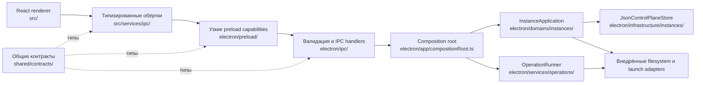

# Архитектура

FriendLauncher — десктопное Electron-приложение с React renderer, собранным через Vite. Все нативные возможности принадлежат main process; там же собирается один канонический домен инстансов. Renderer получает типизированные операции без доступа к файловой системе.



## Границы процессов

### Renderer (`src/`)

Renderer отвечает за интерфейс, переводы, состояние представления и координацию функций. Он работает с `nodeIntegration: false`, `contextIsolation: true` и включённым Electron sandbox.

Правила:

- Не импортировать Node.js или Electron.
- Не принимать и не восстанавливать корень лаунчера, пути инстансов и архивов или путь к Java executable.
- Использовать обёртки `src/services/ipc/*`; не размазывать `window.api.*` по дереву компонентов.
- Любую пользовательскую строку добавлять в `src/locales/en.json` и `src/locales/ru.json`.
- Launch UI живёт в одном дереве `src/features/launcher/`; параллельной реализации launcher быть не должно.

### Preload (`electron/preload.ts`, `electron/preload/bridges/`)

Preload — граница возможностей между renderer и main. Он экспортирует ровно один global — `window.api` из `shared/contracts/windowApi.ts`. Каждый его элемент — узкий семантический контракт. Raw-методы `invoke`, `send`, `on` и `off` renderer-коду недоступны.

Непрозрачный ID не является замаскированным путём. Ссылки на архив привязаны к sender, имеют срок жизни и используются один раз. ID установки Java краткоживущие и привязаны к корню лаунчера, для которого выполнялось сканирование.

### Main process (`electron/`)

Main process отвечает за lifecycle, окна, нативные диалоги, Java-процессы, загрузки, архивы, аккаунты, игровые файлы, обновления и multiplayer networking.

- `electron/app/` — bootstrap и единственный production composition root
- `electron/domains/instances/` — канонические команды, состояние, порты и application service инстансов
- `electron/infrastructure/instances/` — control-plane и filesystem adapters
- `electron/services/operations/` — staged-операции, журнал, root lock и recovery
- `electron/services/*` — узкие content, provider, launcher, account, network и updater services
- `electron/ipc/` — валидация входов и регистрация handlers
- `electron/security/` — правила путей, URL, архивов, разрешений и save-path
- `electron/preload/` — типизированные возможности renderer

`electron/app/bootstrap.ts` один раз создаёт весь граф, восстанавливает зарегистрированные операции до открытия handlers и передаёт внедрённые зависимости в `IPCManager`. Production handlers и services не создают собственные instance store, application или operation runner.

### Общие контракты (`shared/`)

- `shared/contracts/*` описывает preload-интерфейсы и сериализуемые IPC DTO.
- `shared/contracts/ipcChannels.ts` содержит allowlist каналов.
- `shared/contracts/windowApi.ts` задаёт всю поддерживаемую поверхность `window.api`.
- `shared/types/*` содержит данные, общие для процессов.

Не создавайте вторую копию cross-process типа в renderer или main. Публичные запросы операций не могут содержать `rootPath` или `filePath`.

## Граф владения

| Домен | Канонический владелец в main process | Владелец в renderer |
| --- | --- | --- |
| Lifecycle инстансов и выбранное состояние | `electron/domains/instances/instanceApplication.ts` с `electron/infrastructure/instances/jsonControlPlaneStore.ts` | `src/contexts/instances/`, экраны модпаков |
| Transactional import, export, install, update, duplicate, delete | `electron/services/operations/operationRunner.ts` и operation adapters | `src/services/ipc/operationsIPC.ts` и соответствующие features |
| Файлы модов и регистрация manifest | `electron/services/mods/instanceModContentService.ts`, `manifestContentInstaller.ts` | экраны контента и `instanceModsIPC.ts` |
| Запуск и Java | `electron/services/launcher/`, `electron/services/java/`, внедрённые instance/launch ports | `src/features/launcher/`, `src/components/SimplePlayDashboard.tsx` |
| Каталог и установка контента провайдеров | `electron/services/mods/platform/` и provider operation adapters | каталог и семантические wrappers |
| Аккаунты | `electron/services/account/` | `src/features/accounts/` |
| Мультиплеер | `electron/services/network/` | `src/features/multiplayer/` |
| Обновления | `electron/services/updater/` | `src/features/updater/` |
| Ресурспаки, шейдеры, миры, датапаки, скриншоты | узкие services и проверяемые handlers в `electron/services/` и `electron/ipc/handlers/` | modpack detail/content features |

Разделения на базовый instance store и унаследованный modpack facade больше нет. `InstanceApplication` — единственный публичный владелец control-plane чтений и команд. Семантические services зависят от его портов и добавляют только собственное поведение для контента.

## Каноническое устойчивое состояние

Единственный поддерживаемый control-plane документ инстансов — `<launcher-root>/instance-control-plane.json`. `JsonControlPlaneStore` читает и записывает его через версионированный `AtomicJsonStore`: запись создаётся рядом с целевым файлом, синхронизируется и публикуется атомарным rename, а предыдущий корректный документ сохраняется как `.bak`. Повреждённый или неподдерживаемый документ не перезаписывается и остаётся доступен для восстановления.

Обычное чтение никогда не смотрит в legacy state и ничего там не переписывает. Только явная подготовка может прочитать `modpacks.json`, `modpacks-metadata.json` и `modpack.json` каждого инстанса. Она валидирует полный legacy-граф, атомарно публикует один канонический snapshot с migration provenance и на повторных запусках считает canonical primary или backup авторитетным. Пересоздаваемые кэши и сторонние форматы Minecraft намеренно не входят в control-plane контракт.

## Lifecycle транзакции и recovery

Многофайловые изменения проходят один lifecycle:

```text
валидация публичной команды
  -> разрешение launcher root и нативных ссылок в main
  -> получение root mutation lock
  -> запись в приватный staging
  -> проверка staged-результата
  -> сохранение backup при необходимости
  -> публикация изменений файловой системы
  -> commit канонической команды InstanceApplication
  -> публикация sanitised operation snapshot
```

`OperationRunner` отвечает за очередь, отмену, журнал, root lock и зарегистрированные recovery-команды. Журнал может содержать внутренние пути main process, необходимые для восстановления; публичные контракты операций и renderer wrappers — нет. Активные операции доступны только renderer-процессу, который их запустил. Восстановленные snapshots sanitised, terminal и read-only.

Archive import использует непрозрачный `archiveRef`; renderer не получает выбранный путь. Archive export — единственное намеренное исключение для публичного native save: `outputPath` создаётся диалогом main process, авторизуется для sender, один раз потребляется operation handler и далее хранится только во внутренних recovery-данных main. После перезапуска незавершённый export переходит в `recovery-required`, потому что недоверенный журнал не может заново создать истёкшее разрешение на запись.

### Протокол root mutation lock

Разрушительные root-wide операции используют протокол v3 в `.fmcl-operations/locks`. Неизменяемые записи Lamport bakery (`choosing` и `ticket`) выбирают одного writer; каждая запись содержит случайный token и уникальный путь к локальному Node socket владельца. Contender удаляет запись только когда socket однозначно отказал или отклонил token. Таймауты и неоднозначные ошибки локальной сети считаются live и блокируют операцию. Протокол не опирается на PID reuse или прошедшее время и безопасен при suspend процесса.

После победы writer удерживает атомарно опубликованный canonical bridge `mutation.lock` весь callback. Marker `mutation.lock.v3` задаёт границу offline upgrade: перед обновлением до v3, откатом или смешиванием сборок остановите все процессы FMCL с общим custom launcher root. Pre-v3 marker не reclaim-ится; операция fail-closed завершается `ROOT_LOCK_OFFLINE_UPGRADE_REQUIRED`.

## Направление зависимостей

Разрешённое направление:

```text
renderer feature
  -> renderer IPC wrapper
  -> preload semantic capability
  -> validated IPC handler
  -> dependency из composition root
  -> application port или узкий service
  -> infrastructure adapter / операционная система / provider
```

Обратные импорты запрещены. Domain-код не импортирует renderer, preload, регистрацию IPC, Electron или нативные модули Node. Infrastructure и native services реализуют порты, направленные внутрь; создаёт их только composition root.

## Автоматически проверяемые инварианты

`npm run architecture:check` содержит fixture-тесты, которые падают при появлении:

- удалённых legacy owners, stores, transports, aliases и второго launch tree;
- создания canonical store, application service или operation runner вне composition root и тестов;
- Node/Electron imports в instance domain;
- прямой записи control-plane вне `JsonControlPlaneStore`;
- renderer authority через `instancePath`, `resolvePath` и публичные operation `rootPath`/`filePath`;
- импортов удалённого mixed `modpacks` transport.

Дополнительные инварианты безопасности:

- Данные renderer считаются недоверенными на каждой границе main process.
- Дочерние имена и provider IDs валидируются до разрешения путей в main.
- Удалённые URL проходят общую policy, архивы — единую archive policy.
- Секреты аккаунтов остаются в main и шифруются Electron `safeStorage`, когда он доступен.
- Внешняя навигация запрещена внутри приложения и проходит через проверяемый external-link handler.
- Обновление приложения скачивается только после согласия пользователя.

Подробности: [модель безопасности](security.md), [карта IPC-контрактов](contracts-map.md) и [известные проблемы](known-issues.md).

## Несколько инстансов в разработке

В dev можно запустить второй локальный процесс с суффиксом в Electron `userData`. Порты локальных helper-сервисов зависят от номера инстанса; не добавляйте фиксированный порт в обход этой модели. Процессы, намеренно использующие один launcher root, сериализуются root mutation protocol.

## Изменение cross-process функции

Проверьте весь путь:

1. общий контракт и allowlist каналов;
2. preload bridge и тип `window.api`;
3. валидацию и handler в main process;
4. application port или узкий semantic service;
5. injection в composition root;
6. renderer wrapper и UI consumer;
7. тесты и обе языковые карты контрактов.

Перед ревью запустите `npm run verify`, `npm run contracts:check`, `npm run ipc:check` и `npm run architecture:check`.
