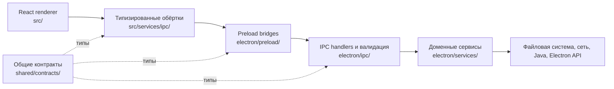

# Архитектура

FriendLauncher — десктопное Electron-приложение с React renderer, который собирается через Vite. Архитектура не даёт веб-интерфейсу прямой доступ к Node.js и возможностям операционной системы.



## Границы процессов

### Renderer (`src/`)

Renderer отвечает за интерфейс, локальное состояние представления, переводы и координацию пользовательских сценариев. Он работает с `nodeIntegration: false`, `contextIsolation: true` и включённым Electron sandbox.

Правила:

- Не импортировать Node.js или Electron.
- Не обращаться к файловой системе или сети через случайные browser globals.
- Использовать обёртки `src/services/ipc/*`; не размазывать вызовы `window.api.*` по компонентам.
- Любую пользовательскую строку добавлять и в `src/locales/en.json`, и в `src/locales/ru.json`.

### Preload (`electron/preload.ts`, `electron/preload/bridges/`)

Preload — граница возможностей между renderer и main process. Он экспортирует ровно один global — `window.api` из `shared/contracts/windowApi.ts`. Каждая возможность описана узким доменным контрактом; raw-методы `invoke`, `send`, `on` и `off` renderer-коду не доступны.

### Main process (`electron/`)

Main process отвечает за окна, lifecycle, нативные диалоги, Java-процессы, загрузки, архивы, аккаунты, игровые файлы, обновления и multiplayer networking.

- `electron/app/` — bootstrap, lifecycle, сборка сервисов, full-install harness
- `electron/window/` — безопасное создание BrowserWindow и защита навигации
- `electron/ipc/` — регистрация handlers и проверка данных на границе процесса
- `electron/security/` — правила для путей, URL, архивов, permissions и save-path
- `electron/services/` — доменная логика
- `electron/preload/` — типизированные возможности для renderer

IPC handler валидирует неизвестные входные данные и передаёт работу сервису. Сервисы не должны импортировать регистрацию handler или preload.

### Общие контракты (`shared/`)

- `shared/contracts/*` описывает preload-интерфейсы и IPC DTO.
- `shared/contracts/ipcChannels.ts` содержит allowlist каналов.
- `shared/contracts/windowApi.ts` задаёт поддерживаемый `window.api`.
- `shared/types/*` содержит доменные данные, общие для процессов.

Не создавайте отдельную копию cross-process типа в renderer или main process.

## Основные домены

| Домен | Main process | Renderer |
| --- | --- | --- |
| Запуск и Java | `electron/services/launcher/`, `electron/services/java/` | `src/features/launcher/`, `src/components/SimplePlayDashboard.tsx` |
| Инстансы модпаков | базовый filesystem/index сервис в `electron/services/instances/`; расширенный фасад import, metadata, content и export в `electron/services/modpacks/` | `src/components/modpacks/`, `src/features/modpacks/`, `src/contexts/ModpackContext.tsx` |
| Моды и провайдеры | `electron/services/mods/` | экраны контента и `src/services/ipc/modsIPC.ts` |
| Аккаунты | `electron/services/account/` | `src/features/accounts/` |
| Мультиплеер | `electron/services/network/` | `src/features/multiplayer/` |
| Обновления | `electron/services/updater/` | `src/features/updater/` |
| Контент | `electron/services/{resourcePacks,shaders,worlds,screenshots,content}/` | функции контента внутри modpack details |

Расширенный `electron/services/modpacks/modpackService.ts` сейчас наследует низкоуровневый instance service. Это совместимый переходный слой, а не приглашение добавлять в фасад новые обязанности.

## Устойчивое локальное состояние

Управляемые JSON-файлы состояния используют версионируемый `AtomicJsonStore` из `electron/services/storage/`. Запись сначала создаётся рядом с целевым файлом, синхронизируется и публикуется атомарным rename; предыдущий корректный документ сохраняется в `.bak`. Повреждённый или неподдерживаемый документ не заменяется пустым значением и остаётся доступен для восстановления. Пересоздаваемые кэши и сторонние форматы Minecraft намеренно не входят в этот контракт.

Install, import, update и разрушительные операции над несколькими файлами проходят через stage, journal и recovery operation engine. Атомарность отдельного control file дополняет, но не заменяет журналируемый сценарий с каталогами. Archive export — намеренное исключение для внешнего пути: после перезапуска операция становится `recovery-required` и сохраняет все артефакты, потому что недоверенный journal не может восстановить истёкшее разрешение native dialog на запись.

### Протокол root mutation lock

Разрушительные root-wide операции используют протокол v3 в `.fmcl-operations/locks`. Неизменяемые записи Lamport bakery (`choosing` и `ticket`) выбирают одного writer; каждая запись содержит случайный token и уникальный путь к локальному Node socket процесса-владельца. Contender удаляет запись только когда socket однозначно отказал или отклонил этот token. Таймауты и другие неоднозначные ошибки локальной сети считаются live и блокируют операцию. Смерть token никогда не разрешает удалять общий endpoint процесса. После `SIGKILL` в системной временной папке может остаться неактивная запись socket со случайным именем; она не переиспользуется. Поэтому протокол не опирается на PID reuse или прошедшее время и безопасен при suspend процесса.

После победы в bakery writer удерживает атомарно опубликованный canonical bridge `mutation.lock` весь callback. Это не позволяет обычному живому старому O_EXCL owner работать одновременно с v3 callback. Marker `mutation.lock.v3` задаёт границу offline upgrade: перед обновлением до v3, откатом версии или смешиванием сборок остановите все процессы FMCL, которые используют один custom launcher root. V3 не reclaim-ит pre-v3 canonical marker: операция fail-closed завершается `ROOT_LOCK_OFFLINE_UPGRADE_REQUIRED`. Гонки stale-reclaimer из pre-v3 явно не поддерживаются.

## Направление зависимостей

Нормальное направление:

```text
renderer component/context
  -> renderer IPC wrapper
  -> preload contract/bridge
  -> validated IPC handler
  -> domain service
  -> operating system или внешний провайдер
```

Обратные импорты запрещены. Доменные сервисы не должны импортировать renderer, preload или регистрацию IPC.

## Инварианты безопасности

- Данные renderer считаются недоверенными на входе main process.
- Пути разрешаются через общие path guards и остаются внутри одобренного root.
- Удалённые URL проходят общую policy, архивы — единую archive policy.
- Секреты аккаунтов остаются в main process и шифруются Electron `safeStorage`, когда он доступен.
- Навигация на внешние адреса блокируется внутри приложения и проходит через проверяемый external-link handler.
- Обновление приложения скачивается только после согласия пользователя.

Подробности: [модель безопасности](security.md) и [известные проблемы](known-issues.md).

## Несколько инстансов в разработке

В dev можно запустить второй локальный инстанс с суффиксом в Electron `userData`. Порты локальных helper-сервисов зависят от номера инстанса; не добавляйте новый фиксированный порт в обход этой схемы.

## Изменение cross-process функции

Проверьте весь путь:

1. общий тип или контракт;
2. preload bridge и тип `window.api`;
3. валидацию и handler в main process;
4. доменный сервис;
5. renderer-обёртку;
6. UI и тесты;
7. обе карты контрактов, если меняется канал.

Перед ревью запустите `npm run contracts:check`, `npm run ipc:check`, `npm run architecture:check` и релевантные тесты.
